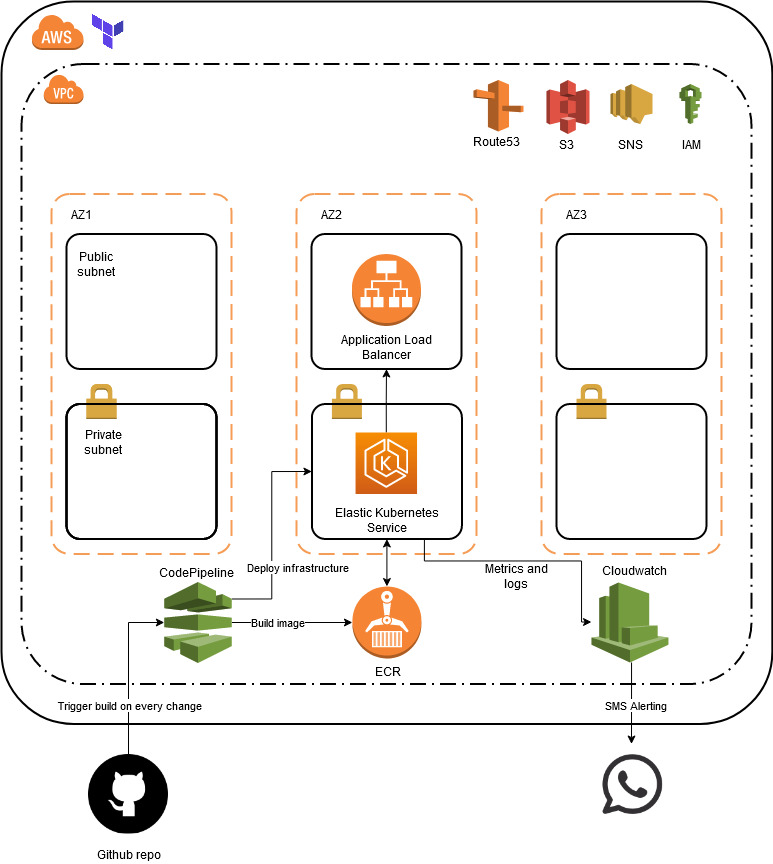

# SRE Challenge

Terraform script that deploy a full infrastructure in AWS, with application deploy pipeline and SMS alerting.

## Prerequisites

- awscli v2 (https://docs.aws.amazon.com/cli/latest/userguide/install-cliv2.htmlkube)
- kubectl v1.18 (https://kubernetes.io/docs/tasks/tools/install-kubectl/)
- Terraform cli v0.13 (https://learn.hashicorp.com/tutorials/terraform/install-cli)
- Github account with access token created (https://github.com/settings/tokens), with the following permissions:
    - admin:repo_hook
    - repo

## Architecture diagram



## Configure AWS user

You will need to create a programatic user with 'AdministratorAccess' policy enabled.

Configure this user in your console:

```
aws configure
```

This project is composed by 2 different folders:
- app: Application code
- infrastructure: Terraform code to deploy infrastructure on AWS

Terraform code contains 3 differents modules:

- EKS: EKS, ECR and cluster needed tools 
- Network: VPC, Subnets, IGW y NAT.
- Pipeline: CodePipeline and CodeBuild configuration with Github webhook

## Init Terraform

A tfvars file is needed to create the infrastructure, check TFVars table below. I recommend to place the tfvars file into a vars folder in infrastructure.

We will need to init our Terraform modules with the following command:

```
cd infrastructure
terraform init
```

## Apply Terraform

To deploy the whole infrastructure, you will need to execute the following command:

```
terraform apply -var-file=./vars/file.tfvars
```

You can also deploy module by module:

```
terraform apply -target module.network -var-file=./vars/file.tfvars
```

## Terraform 0.13 Providers

|     Nombre   |   Versión   |
|--------------|-------------|
|     aws      |  ~> 3.27.0  |
|   github     |  ~> 4.4.0   |
|  template    |  ~> 3.27.0  |
|    null      |  ~> 3.0.0   |
|  kubernetes  |  ~> 4.4.0   |

## TFvars

|          Nombre           |                        Descripción                              |        Tipo         |
|---------------------------|-----------------------------------------------------------------|---------------------|
|aws_access_key             |AWS access key                                                   |'string'             |
|aws_secret_key             |AWS secret key                                                   |'string'             |
|location                   |Region                                                           |'string'             |
|resource_prefix            |Project identifier                                               |'string'             |
|project                    |Project name                                                     |'string'             |
|environment                |Environment name                                                 |'string'             |
|cidr                       |VPC CIDR                                                         |'string'             |
|availability_zones         |Availability zones count                                         |'number'             |
|instance_type_workers      |EKS Node instance type                                           |'string'             |
|max_workers                |Max nodes number of EKS                                          |'number'             |
|min_workers                |Min nodes number of EKS                                          |'number'             |
|des_workers                |Desired nodes number of EKS                                      |'number'             |
|github_owner               |Github project owner name                                        |'string'             |
|github_token               |Github authentication generated token                            |'string'             |
|alerting_sms_number        |Telephone number with country code to send sms on alert          |'string'             |

## Check Hello World endpoint

An Application Load Balancer will be deployed in your AWS account. Check DNS name under EC2 -> Load Balancers. 
5 minutes are needed more or less to execute the pipeline and create the Load Balancer. Enjoy the automation!